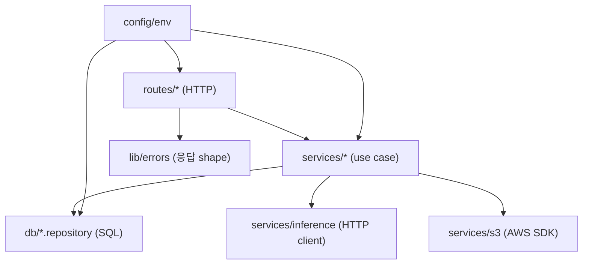

# Backend Folder Structure Guide

`backend/` 디렉토리(`core-api`)의 폴더 구조와 역할 가이드입니다.

## 디렉토리 트리

```
backend/
├── src/
│   ├── server.ts             엔트리포인트 (listen + graceful shutdown)
│   ├── app.ts                Fastify 인스턴스 빌더 + 공통 에러 핸들러
│   ├── config/
│   │   └── env.ts            dotenv + zod 환경변수 검증 (단일 진실)
│   ├── routes/               HTTP 엔드포인트 (zod 검증 + service 호출)
│   │   ├── health.ts
│   │   ├── uploads.ts
│   │   └── matches.ts
│   ├── services/             비즈니스 유스케이스
│   │   ├── s3.ts             presigned URL 발급
│   │   ├── inference.ts      inference-api 호출 클라이언트
│   │   └── voiceMatch.ts     E2E 음색 매칭 흐름
│   ├── db/
│   │   ├── pool.ts           pg Pool + pgvector 타입 등록
│   │   └── voiceProfiles.repository.ts
│   ├── lib/
│   │   ├── errors.ts         ApiError 계열 + 응답 shape
│   │   └── logger.ts         Pino 인스턴스
│   └── types/api.ts          요청/응답 타입 (snake_case)
├── db/
│   └── migrations/           SQL 마이그레이션 (.sql)
├── scripts/
│   └── migrate.ts            마이그레이션 러너
└── docs/                     백엔드 전용 문서
```

## 레이어 책임 분리



| 레이어 | 책임 | 금지 사항 |
|--------|------|-----------|
| `routes/` | HTTP 어댑팅, zod 검증, service 호출 | SQL 직접 작성, 외부 HTTP 호출 |
| `services/` | 유스케이스 조립, 도메인 규칙 | Fastify req/reply 의존, SQL 직접 작성 |
| `db/*.repository` | SQL 캡슐화, 결과 매핑 | HTTP/도메인 로직, env 직접 접근 |
| `lib/` | 공용 유틸 (errors, logger) | 비즈니스 로직 |
| `config/env` | 환경변수 로드/검증 | 다른 모듈 import (순환 금지) |
| `types/` | 외부 노출 타입 only | 런타임 코드 |

## Path Alias

`tsconfig.json` 의 `paths` 설정으로 `@/*` 절대경로 사용:

```ts
import { env } from "@/config/env.js";
import { ApiError } from "@/lib/errors.js";
import { matchByVoice } from "@/services/voiceMatch.js";
```

> ESM + bundler resolution 기준이므로 import 경로에 `.js` 확장자를 붙입니다.
> (TypeScript 파일은 `.ts` 이지만 컴파일 후 `.js` 가 되며, tsx/Node 모두 호환)

## 파일명 컨벤션

| 종류 | 규칙 | 예시 |
|------|------|------|
| 모듈 | kebab-case | `voiceProfiles.repository.ts` |
| 라우트 | kebab-case + 도메인명 | `matches.ts` |
| 클래스/타입 | PascalCase | `ApiError`, `PresignedUrlResponse` |
| 함수/변수 | camelCase | `embedAudio`, `findSimilarProfiles` |
| SQL 마이그레이션 | `NNNN_<name>.sql` | `0001_init.sql` |

## 외부 노출 응답 규칙

- 필드명은 `snake_case` 로 직렬화 (프론트 `types/api.ts` 와 1:1 매칭)
- 모든 에러 응답은 `{ error: { code, message, request_id? } }` shape
- 응답 헤더에 `x-request-id` 포함 (요청 헤더로 들어온 값이 있으면 그대로 전파)

## Update Log

- 2026-05-25: 0002 마이그레이션 적용에 따른 메타데이터 필터 및 리포지토리 쿼리 정보 구조 보완
- 2026-05-17: 초기 폴더 구조 가이드 작성 (Phase 1 skeleton)
